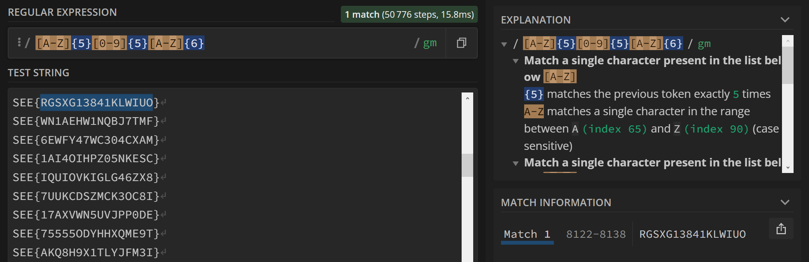

## Challenge Name: Regex101
Author: Gelos
Category: Misc
Points: 100
Tags: Beginner Friendly

Our team stored a flag on our machine, however, we were hacked by someone, and he generated 2999 flags and hid our original flag in the .txt file. The flag consists of 5 uppercase letters, followed by 5 digits and another 6 uppercase letters. Can you find it for us?

MD5: 20651445a358372970c74c270d5995d3

### Approach
Unzipping the file, we have 
Since we need 5 uppercase latters, followed by 5 digits and another 6 uppercase letters, we can make use of the regex [A-Z] as well as [0-9], along with the quantifier {5} and {6}
The regex to be used is: [A-Z]{5}[0-9]{5}[A-Z]{6}
Using an app locally, or a website like https://regex101.com, paste the regex in and find your answer

### Flag
SEE{RGSXG13841KLWIUO}

---
[Back to home](https://github.com/Team-Rainbow-Hash/seetf-2022-writeups)